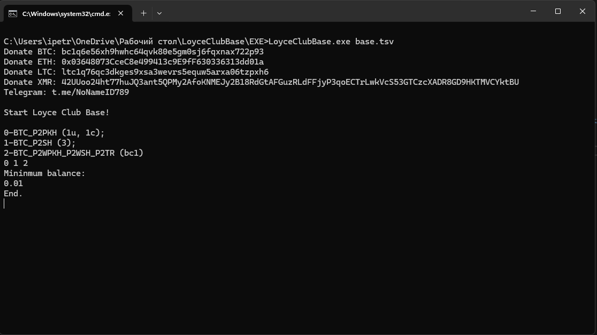

# Loyce Club Base
Данная утилита работает с базой [addresses-loyce-club](http://addresses.loyce.club/).

Для работы небходимо загрузить базу с балансом
``` 
Sample:
address                            balance
35hK24tcLEWcgNA4JxpvbkNkoAcDGqQPsP 25550215765875
3KZ526NxCVXbKwwP66RgM3pte6zW4gY1tD 10185724750535
37XuVSEpWW4trkfmvWzegTHQt7BdktSKUs 9450577254951
```

ПО находится в папке **EXE**


## Как запустить?
Для запуска надо разархивировать архив с адресами, переименовать в _base.tsv_ и положить в корень _EXE_. Далее два раза кликаете RUN.BAT.

ПО спросить 2 вороса:

## Первое, это список того что хотите получить на выходе. Адреса 1Uncompressed..., 1Compressed..., 3..., bc1...

Выбирать можно как один тип, так и комбинировать. Например только 0, или 0 1. Между значениями укажите пробел

## Второе, что неоходимо выбрать, это минимальное количество баланса.

И после успешной работы утилиты, получите чистую базу с адресами, которые выбрали.

Если программа не запускается, нужно установить дополнительно [.NET 8.0 Runtime x64](https://dotnet.microsoft.com/en-us/download/dotnet/thank-you/runtime-8.0.10-windows-x64-installer)


